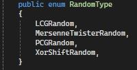

# Tyche
Проект, выполненный в рамках дисциплины "Проектирование на языке C#".  
Над проектом работали:
* Халимов Далер
* Межин Матвей
* Обухов Даниил

    

 

**Описание**
=====================
***Tyche - оконное приложение, представляющее собой генератор случайных чисел, распределённых по выбранному закону.***  
На текущий момент Tyche поддерживает следующие распределения:
* Нормальное
* Экспоненциальное
* Равномерное

Для генерации случайных чисел используются следующие алгоритмы Random:
* LCG Random
* PCG Random
* Xor Shift Random
* Mersenne Twister Random

  

**Стек**
=====================
* .NET 7.0
* Windows Forms

**Расширяемость**
=====================
Добавление новых алгоритмов рандома производится так:  
1. Добавить новый RandomType в Engine.RandomType

   
   
2. Создать новый класс, унаследованный от Random. Переопределить в нём метод NextDouble (т.к. Tyche генерирует Double значения) и другие необходимые методы

    
   
3. Проинициализировать ваш Random в методе SetRandomInformation класса EngineModule

    

Добавление новых распределений происходит аналогичным образом, но наследование необходимо выполнять от класса AbstractContinuousDistribution, добавлять DistributionType в Engine.DistributionType, а инициализацию Distribution проводить в методе SetDistributionInformation.

  

**Структура**
=====================  
Мы старались придерживаться DDD структуры и абстрагировать слои друг от друга. Однако, некоторые элементы всё ещё требуют доработки для соответствия DI паттерну.
Тесты находятся в отдельном проекте.  

    
  

  

**TODO**
=====================    
20.01 - Изменение SettingsForm и MainForm для соответствия DI паттерну.

  

